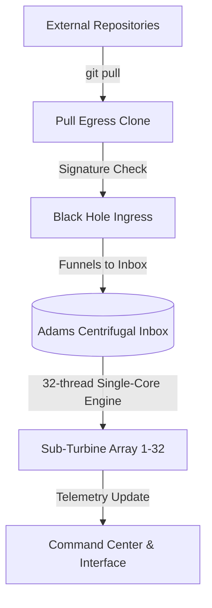

# RegimeOS Technical Manual & System Documentation
**Version 4.1-Windows**

Welcome to the official RegimeOS technical documentation. This manual provides details on the architectural layout, core math engine, configuration parameters, security protocols, and operational workflows of the system.

---

## 1. System Architecture

The RegimeOS system uses a tri-polar processing topology to control, process, and direct incoming payload impulses across scaled turbine nodes.



### Key Folders & Paths
*   `C:\RegimeOS\bin\`: Contains operational scripts and command executables.
*   `C:\RegimeOS\kernel\`: The core engine room containing configuration and multithreaded runspace management scripts.
*   `C:\RegimeOS\adams_sierpinski\inbox\`: The central data ingestion folder.
*   `C:\RegimeOS\adams_sierpinski\processed\`: Archive for processed payloads.
*   `C:\RegimeOS\turbine_sub\`: Individual telemetry profiles and configurations for the 32 sub-turbines.
*   `C:\RegimeOS\core_geodisc\state\`: Houses the visual command dashboard and state verification engines.

---

## 2. Core Mathematical Engine (`regime_math.py`)

The mathematical engine underpins the tri-polar validation logic, consisting of three main structural classes:

### A. `TernaryBinaryEncoder`
*   **Purpose**: Encodes data bits into tri-polar states (`[-1, 0, 1]`).
*   **Significance**: Prevents boundary collisions by balancing values around the zero center.

### B. `SokhotskySifter`
*   **Purpose**: Implements Sokhotsky–Plemelj formulas to calculate boundary limits of complex integrands.
*   **Significance**: Used to compute velocity limits and ensure turbine rotor stability during high-frequency cycles.

### C. `HahnRegimeSeries`
*   **Purpose**: Models Hahn polynomial sequences to evaluate orthogonal trajectories of scaled turbine states.
*   **Significance**: Predicts power coefficients across all 32 sub-turbines.

---

## 3. Configuration & Commands

### Scaling Sub-Turbines
The system operates at a configuration of **32 sub-turbines**.
*   **Main Configuration File**: `C:\RegimeOS\kernel\regime_config.py`
    ```python
    SUB_TURBINE_COUNT = 32
    MAX_RPM = 500
    ```
*   **Concurreny Pool**: The runspace pool in `C:\RegimeOS\kernel\single-core.ps1` dynamically allocates 32 threads.

### Primary Commands
*   **Auto-Boot Start**: `C:\RegimeOS\bin\autostart-regimeos.ps1`
*   **Command Center UI**: `python C:\RegimeOS\core_geodisc\state\interface.py`
*   **Sub-Turbine Telemetry**: `powershell -File C:\RegimeOS\bin\sub-turbine-telemetry.ps1`
*   **Health Check**: `C:\RegimeOS\bin\health-check.bat`

---

## 4. Security Protocols (STRATSEC)

RegimeOS utilizes a weaponized ingress trap to protect the core:
1.  **Ingress Signature**: Payload files must contain `"signature": "ARMADA_VALID"`.
2.  **Verification**: The `black_hole_ingress.ps1` daemon checks the signature.
    *   **Valid Signature**: File is fed directly into the inbox.
    *   **Invalid/Missing Signature**: The file is purged, and the intrusion is logged in `logs\system\history.md`.

---

## 5. Troubleshooting & Maintenance

*   **Log Files**: System history is logged to `C:\RegimeOS\logs\system\history.md`.
*   **Log Rotation**: Log files are automatically rotated by `monitor-stability.ps1` once they exceed 10 KB to maintain optimal performance.
*   **System Reset**: Run `C:\RegimeOS\bin\health-check.bat` to verify the state of all active components.
