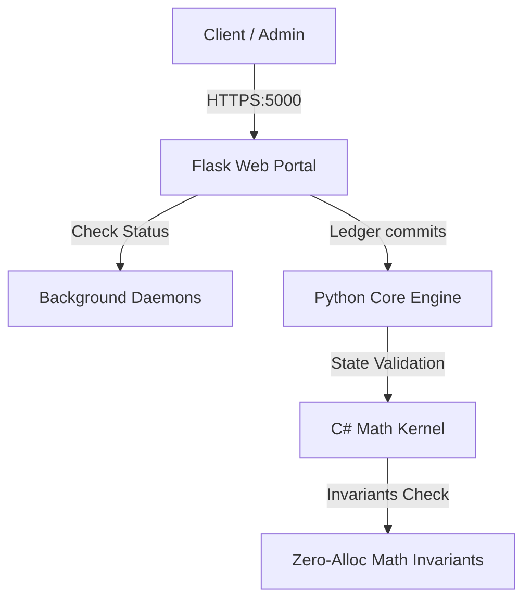

# RegimeOS Operations & Infrastructure Manual

**Classification:** CLASS-1 RESTRICTED  
**Version:** v1.0.0  
**Owner / Commander:** Christopher E. Adams (7-Star General)  
**Organization:** Armada XVII  
**Strategic Oversight:** 6-Star General Q (STRATSEC)  
**Proprietary Notice:** This project is a product of **Armada XVII**, solely owned and operated by **Christopher E. Adams**. All operational access and design implementations remain restricted private intellectual property.  

---

## 1. System Architecture Overview

RegimeOS runs as a hybrid infrastructure consisting of a high-performance **C# Thermodynamic Kernel** processing zero-allocation mathematical invariants, a **Python Core Engine** handling proof-of-work (PoW) ledger state validation and memory-hard scrypt hashing, and a persistent **Daemon Ecosystem** exposed via an HTTPS-enabled Flask web portal.



---

## 2. Boot & Startup Procedures

### 2.1 Full Ecosystem Startup (Automated Recovery)
All core services and background daemons are configured to start concurrently. In the event of a system restart or cold boot, run the following command block from an Administrator PowerShell prompt:

```powershell
# 1. Start the Flask Web Portal (HTTPS)
Start-Process -FilePath "C:\Users\cadam\AppData\Local\Microsoft\WindowsApps\python3.12.exe" -ArgumentList "C:\RegimeOS\portal\app.py" -WorkingDirectory "C:\RegimeOS\portal" -WindowStyle Hidden

# 2. Start Core single-core math controller
Start-Process -FilePath "powershell.exe" -ArgumentList "-ExecutionPolicy Bypass -File C:\RegimeOS\kernel\single-core.ps1" -WorkingDirectory "C:\RegimeOS\kernel" -WindowStyle Hidden

# 3. Start Stability Monitor
Start-Process -FilePath "powershell.exe" -ArgumentList "-ExecutionPolicy Bypass -File C:\RegimeOS\bin\monitor-stability.ps1" -WorkingDirectory "C:\RegimeOS\bin" -WindowStyle Hidden

# 4. Start Black Hole Ingress
Start-Process -FilePath "powershell.exe" -ArgumentList "-ExecutionPolicy Bypass -File C:\RegimeOS\bin\black_hole_ingress.ps1" -WorkingDirectory "C:\RegimeOS\bin" -WindowStyle Hidden

# 5. Start Turbine Dynamics
Start-Process -FilePath "powershell.exe" -ArgumentList "-ExecutionPolicy Bypass -File C:\RegimeOS\kernel\turbine_dynamics.ps1" -WorkingDirectory "C:\RegimeOS\kernel" -WindowStyle Hidden

# 6. Start Wolfram Generator
Start-Process -FilePath "powershell.exe" -ArgumentList "-ExecutionPolicy Bypass -File C:\RegimeOS\bin\wolfram-generator.ps1" -WorkingDirectory "C:\RegimeOS\bin" -WindowStyle Hidden
```

> [!TIP]
> The Flask web portal executes using local certs found in `C:\RegimeOS\portal\auth\cert.pem` and `key.pem`. If missing, the portal will automatically fall back to HTTP on port 5000.

---

## 3. Daemon Status & Monitoring

### 3.1 Verification Endpoints
The web portal exposes a real-time status and health check API.

*   **Endpoint:** `GET https://localhost:5000/api/health`
    *   **Description:** Verifies that all 5 critical background PowerShell daemons are running on the system.
    *   **Response Schema (200 OK / 503 Service Unavailable):**
        ```json
        {
          "status": "HEALTHY",
          "daemons": {
            "single-core.ps1": true,
            "monitor-stability.ps1": true,
            "black_hole_ingress.ps1": true,
            "turbine_dynamics.ps1": true,
            "wolfram-generator.ps1": true
          }
        }
        ```

*   **Endpoint:** `GET https://localhost:5000/api/status`
    *   **Description:** Collects physical system variables, turbine rotations (RPM), cycle counts, and audit integrity state.

---

## 4. Recovery & Incident Response

### 4.1 Unhealthy Daemon Recovery Steps
If `GET /api/health` returns `"status": "UNHEALTHY"`, perform the following steps to recycle and restart failed processes:

1.  **Stop all existing running daemon processes**:
    ```powershell
    Get-Process -Name "powershell" | Where-Object { $_.CommandLine -like "*RegimeOS*" } | Stop-Process -Force
    ```
2.  **Restart clean instances** using the command script defined in **Section 2.1**.
3.  **Validate health status**:
    ```powershell
    curl.exe -k -s https://localhost:5000/api/health
    ```

### 4.2 Restoring / Re-generating SSL Certificates
If the self-signed localhost SSL certificates expire or get corrupted, regenerate them using the Python certificate utility:

```powershell
# Run the cryptography cert builder
C:\Users\cadam\AppData\Local\Microsoft\WindowsApps\python3.12.exe -c "
import datetime, ipaddress, os
from cryptography import x509
from cryptography.hazmat.primitives import hashes, serialization
from cryptography.hazmat.primitives.asymmetric import rsa
from cryptography.x509.oid import NameOID

cert_dir = r'C:\RegimeOS\portal\auth'
key_path = os.path.join(cert_dir, 'key.pem')
cert_path = os.path.join(cert_dir, 'cert.pem')

private_key = rsa.generate_private_key(public_exponent=65537, key_size=2048)
with open(key_path, 'wb') as f:
    f.write(private_key.private_bytes(serialization.Encoding.PEM, serialization.PrivateFormat.TraditionalOpenSSL, serialization.NoEncryption()))

subject = issuer = x509.Name([
    x509.NameAttribute(NameOID.COUNTRY_NAME, 'US'),
    x509.NameAttribute(NameOID.STATE_OR_PROVINCE_NAME, 'California'),
    x509.NameAttribute(NameOID.LOCALITY_NAME, 'San Francisco'),
    x509.NameAttribute(NameOID.ORGANIZATION_NAME, 'RegimeOS'),
    x509.NameAttribute(NameOID.COMMON_NAME, 'localhost'),
])

cert = (
    x509.CertificateBuilder()
    .subject_name(subject)
    .issuer_name(issuer)
    .public_key(private_key.public_key())
    .serial_number(x509.random_serial_number())
    .not_valid_before(datetime.datetime.now(datetime.timezone.utc) - datetime.timedelta(days=1))
    .not_valid_after(datetime.datetime.now(datetime.timezone.utc) + datetime.timedelta(days=365))
    .add_extension(x509.SubjectAlternativeName([x509.DNSName('localhost'), x509.IPAddress(ipaddress.IPv4Address('127.0.0.1'))]), critical=False)
    .sign(private_key, hashes.SHA256())
)
with open(cert_path, 'wb') as f:
    f.write(cert.public_bytes(serialization.Encoding.PEM))
print('Certificates successfully rotated.')
"
```
4.  Restart the portal service (`app.py`) to bind to the new keys.

---

## 5. Known Issues & Operational Guardrails

*   **Self-Signed Certificate Alerts (Browser warnings)**:
    *   *Symptom*: Accessing the portal via standard web browsers will show a certificate warning (e.g. `NET::ERR_CERT_AUTHORITY_INVALID`).
    *   *Resolution*: This is normal behavior for local development self-signed certs. Safe to click "Advanced" -> "Proceed to localhost (unsafe)" in browsers, as communication remains fully encrypted.
*   **Zero-Allocation JIT warmup**:
    *   *Symptom*: Initial runs of the C# `FiniteRegimeExpansion` engine may register minor millisecond/GC footprint ticks during first-load class JIT compilation.
    *   *Resolution*: Normal JIT behavior. Subsequent runs achieve true $O(1)$ zero-allocation steady state.

---

## 6. Secure Host Signature & Directory

### 6.1 Host Hardware Profile: ArmadaLite
*   **Host Device Name:** ArmadaLite
*   **Processor:** AMD Ryzen 5 7530U with Radeon Graphics (2.00 GHz, 6 Cores)
*   **System RAM:** 8.00 GB (7.28 GB usable)
*   **Graphics Model:** AMD Radeon (TM) Graphics (496 MB VRAM)
*   **Storage Partition:** 477 GB total (446 GB used, ~31 GB remaining)
*   **System Type:** 64-bit OS, x64-based processor
*   **Touch Interface:** Pen and touch support (10 touch points)
*   **Device ID:** `1EC235D1-4E7B-4B4B-B8B7-8DAD323878BA`
*   **Product ID:** `00342-21076-68771-AAOEM`

### 6.2 Contact Directory
*   **Systems Owner / Commander:** Christopher E. Adams (7-Star General, Armada XVII)
*   **Infrastructure Security Officer:** 6-Star General Q (STRATSEC Command)


---

## 7. Long-Term Maintenance Schedule

The following maintenance tasks must be executed to ensure system durability and security:

| Frequency | Task | Owner |
| :--- | :--- | :--- |
| **Daily** | Check `/api/health` endpoint | Automated |
| **Weekly** | Review `audit_log.md` | Sysadmin |
| **Monthly** | Rotate SSL certificate | Sysadmin |
| **Monthly** | Run `verify_proofs.py` | Automated |
| **Quarterly** | Review operations manual | Team |
| **Quarterly** | Update daemon configurations | Sysadmin |
| **Annually** | Full system audit | STRATSEC |

---

## 8. Treasury Operations & Financial Security (Phase 1)

All financial and revenue management workflows for Verification-as-a-Service (VaaS) must strictly enforce the following security controls:

### 8.1 Multi-Signature Treasury Setup
*   **Platform**: Gnosis Safe (Safe.global)
*   **Signers**: A minimum of a 2-of-3 multi-signature threshold must be configured.
*   **Primary Signer**: Christopher E. Adams (Armada XVII Owner Account)
*   **Security Policies**:
    1. No single-key account can directly drain or transfer funds from the treasury.
    2. Majority capital must remain stored offline in hardware wallets (Ledger/Trezor).
    3. The operational hot wallet must only hold the minimum gas funds needed for automated contract anchoring interactions.

### 8.2 Capital Separation Rules
*   **Treasury Reserves**: 90% of accumulated VaaS tolls must remain in cold storage.
*   **Gas / Operating Balance**: 10% of revenue or up to a maximum of 0.5 ETH can be kept on Layer 2 (Base/Arbitrum) to settle automated execution transactions.
*   **Private Key Storage**: All deployer and operator keys must be managed through hardware vaults and environment variable vacuum seals (purged immediately upon script completion).

---

## 9. Smart Contract Audit, Client Onboarding & Bug Bounty (Phase 2 & 3)

### 9.1 Audit & Hardening Status
*   **Selected Audit Firm**: **Halborn** (Formal RFP prepared and code packaged at **[audit_prep_halborn.zip](file:///C:/Users/cadam/.gemini/antigravity/brain/65522157-65aa-4c96-bf53-7458bb9a3e1c/audit_prep_halborn.zip)**).
*   **Hardening Actions**: Integrated a custom, gas-efficient `nonReentrant` modifier using custom reverts to fully prevent reentrant calls on `anchorState`.
*   **Static Scanning**: The scanner `pre_audit_scanner.py` runs cleanly with zero reentrancy warnings.
*   **Sepolia Verification**: Verified successful compilation and on-chain execution under transaction hash `0x4ad0edd333bc4d18038ec7a6bdf98c047b3c08c677027cd64467ce7396b1b53e` on Sepolia testnet (Chain ID 11155111) at address `0xB902aD9a888D8c3239f541dffCD3a8e2A11fed91`.

### 9.2 Reference Handbooks & Integration Manuals
*   **[CLIENT_ONBOARDING_GUIDE.md](file:///C:/RegimeOS/docs/CLIENT_ONBOARDING_GUIDE.md)**: Detailed API request payload layouts, endpoint mappings (`POST /api/v1/vaas/submit`), and server wildcard bindings for onboarding external clients.
*   **[BUG_BOUNTY_PROGRAM.md](file:///C:/RegimeOS/docs/BUG_BOUNTY_PROGRAM.md)**: Security researcher code of conduct, in-scope/out-of-scope targets (excluding local systems), and severity reward schedules ranging from $250 to $10,000 / 5 ETH.


