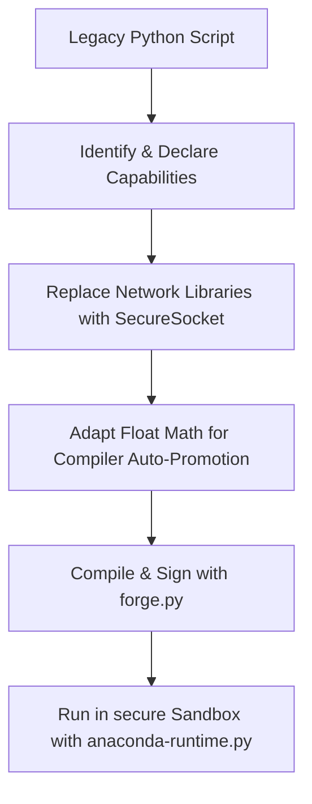

# ANACONDA Migration & Porting Guide
## Classification: BLACK PROJECT // SOVEREIGN

This guide assists developers in migrating legacy Python daemons and scripts to the **ANACONDA Sovereign Environment**.

---

## 🧭 Migration Flow

The migration of legacy python files to secure ANACONDA-IR (.air) involves five phases:



---

## 1. Declaring Capabilities

ANACONDA enforces a strict **Default Deny All** capability sandbox. If your script attempts to read/write files or make network requests without declaring the appropriate capability, it will raise a `PermissionError` and halt.

Declare capabilities at the very top of your `.ana` script using special header comments:
```python
# @capability: filesystem
# @capability: network
```

Available Capabilities:
- `filesystem`: Enforces path-traversal checks. Allows reading and writing inside the authorized workspace.
- `network`: Authorizes standard socket layer initialization.

---

## 2. Hardening Network Communications

Legacy Python modules (such as `requests`, `urllib.request`, `socket`, `http`) are **blocked** by the `AnacondaMetaFinder` import interceptor.

All remote queries must be refactored to use the hardened, anonymous `SecureSocket` class located in `src.stdlib.secure_sock`.

### ❌ Legacy Python Code
```python
import urllib.request
import json

response = urllib.request.urlopen("https://mainnet.base.org")
data = json.loads(response.read().decode())
```

###  ANACONDA Secured Code
```python
import json
from src.stdlib.secure_sock import SecureSocket

# Create SecureSocket (enforces TLS 1.3, ChaCha20-Poly1305, strips telemetry headers)
sock = SecureSocket()
sock.connect(("mainnet.base.org", 443))

payload = json.dumps({"jsonrpc": "2.0", "method": "eth_gasPrice", "params": [], "id": 1})
req = (
    "POST / HTTP/1.1\r\n"
    "Host: mainnet.base.org\r\n"
    "Content-Type: application/json\r\n"
    "Content-Length: " + str(len(payload)) + "\r\n"
    "Connection: close\r\n\r\n" + payload
)
sock.sendall(req.encode('utf-8'))

# Receive response
resp = b""
while True:
    chunk = sock.recv(4096)
    if not chunk:
        break
    resp += chunk
sock.close()
```

---

## 3. High-Precision Math & Float Promotion

The ANACONDA compiler automatically promotes standard floats and logic to the secure math kernel during transpilation:
- All floating-point constants (e.g. `5.0`) are transformed into `RegimeDecimal.from_str('5.0')`.
- Logical booleans (`True`, `False`) are promoted to `Ternary(1)` and `Ternary(-1)`.
- Global calls to `float(x)` are transformed into `RegimeDecimal.from_float(x)`.

### Special Conversion: JSON Serialization
Since `RegimeDecimal` is not directly serializable by Python's native `json` library, you must convert values back to Python floats when preparing payloads:
```python
# Call the to_float() method explicitly to bypass the compiler float-promotion interceptor
payload = {
    "gas_price": gwei_gas.to_float() if hasattr(gwei_gas, "to_float") else gwei_gas
}
```

### Special Conversion: Environment Parsing
If you need to parse string environment variables into native Python floats inside a daemon (such as `POLL_INTERVAL`), call the `builtins.float` attribute directly so the compiler does not rewrite it:
```python
import builtins
poll_interval = builtins.float(os.environ.get("POLL_INTERVAL", "30.0"))
```

---

## 4. Compilation & Deployment

Compile your ported script to compile, sign, and verify manifest integrity:
```powershell
python src/compiler/forge.py --ingest src/examples/financial_ingester.ana --output src/examples/financial_ingester.air
```
This generates the transpiled code, appends the cryptographically secure signature block to the file end, and signs the manifest.
